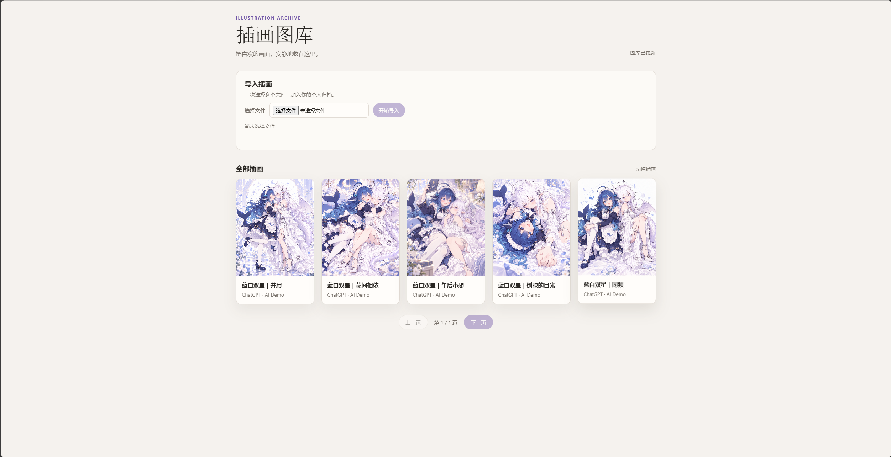
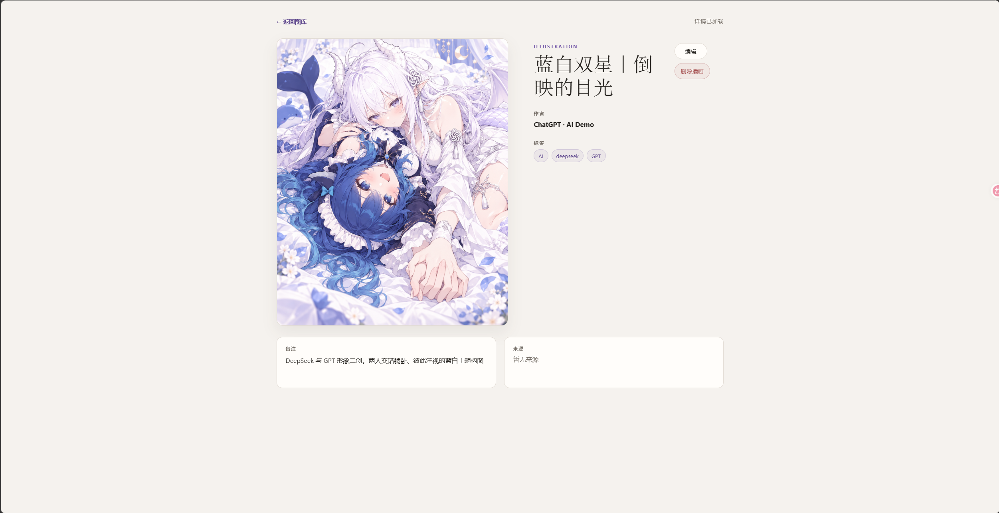
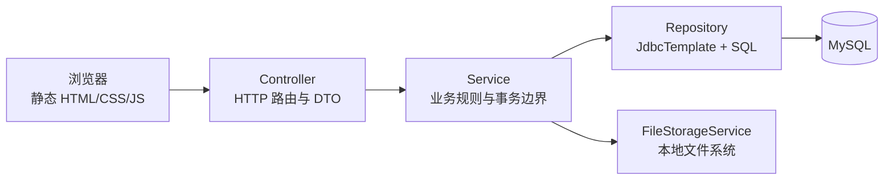
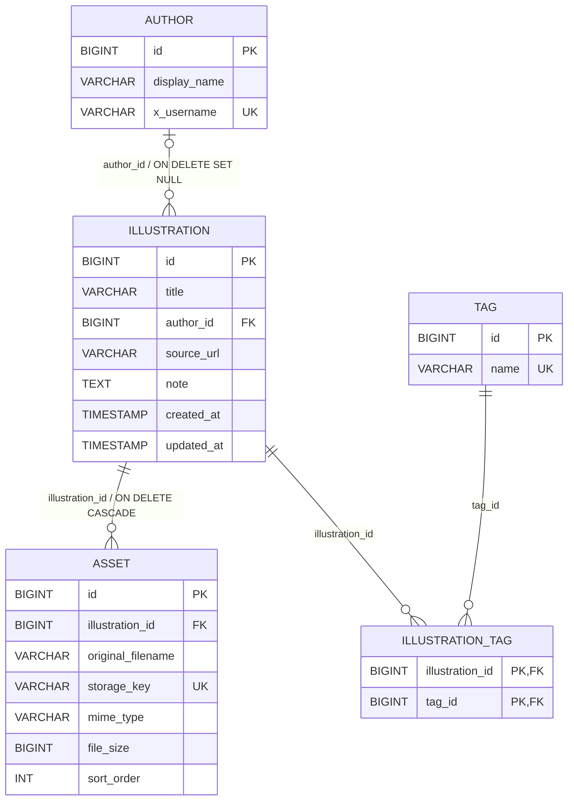

# Illustration Archive

一个面向个人使用的插画归档工具：用 Spring Boot 提供导入、图库、详情和元数据管理 API，用本地文件系统保存图片本体，用 MySQL 保存可查询的插画元数据。

## 项目简介

Illustration Archive 解决的是“把散落在本地的插画文件整理成可浏览、可追踪的个人图库”这一问题。

V0.1 采用 local-first 设计：图片文件留在配置的本地存储目录，数据库只保存插画、作者、标签以及文件元数据。浏览器端使用 Spring Boot 静态资源目录中的原生 HTML、CSS 和 JavaScript，不需要前端构建工具。

项目当前以 `v0.1.0` tag 作为第一个可用版本基线。

## 项目截图

### 图库首页

支持批量导入插画，并以分页卡片形式展示图库内容。



### 插画详情页

支持查看插画大图、标题、作者、标签、备注和来源等元数据，并提供编辑与删除入口。



## V0.1 已完成功能

- 公开 HTTP 接口通过 `multipart/form-data` 批量导入 JPG、JPEG、PNG、GIF 图片；`IllustrationBatchImportService` 逐项复用 `IllustrationImportService.importSingle(...)`，支持部分成功并返回每个文件的处理结果。
- 首页图库分页浏览，默认每页 24 条；卡片显示封面、标题和作者，并可进入详情页。
- 详情页读取主图片、标题、作者、标签、备注和来源链接。
- 编辑标题、来源链接、备注，并通过 PATCH 更新已有 Author 关联和 Tag 关联。
- 搜索和创建 Author；搜索、创建、选择、移除 Tag。
- 删除单个 Illustration，并在数据库删除事务提交后清理对应的本地图片文件。
- 通过 Asset 内容接口按 `asset id` 读取图片流；HTTP DTO 不暴露 `storage_key` 或本地绝对路径。
- 首页和详情页包含加载失败、空数据、图片加载失败以及批量导入结果等基础状态反馈。

## 技术栈

- Java 17
- Spring Boot 4.1.1
- Spring Web MVC
- Spring JDBC（`JdbcTemplate`）
- Flyway（数据库迁移）
- MySQL Connector/J
- Maven Wrapper
- 原生 HTML、CSS、JavaScript
- JUnit 5、Mockito、standalone MockMvc（测试）

项目没有使用 JPA；SQL 由 Repository 层通过 `JdbcTemplate` 执行。

## 系统架构



- `Controller` 只负责 HTTP 映射、参数接收和响应状态。
- `Service` 负责导入、编辑、删除、分页等业务流程，以及需要事务的数据库操作。
- `Repository` 集中保存 SQL 和结果映射。
- `FileStorageService` 负责文件校验、流式保存、读取、删除和存储路径安全检查。
- 静态前端通过 `/api/...` 调用后端，不直接接触数据库或文件系统路径。

## 数据模型与实体关系



- 一个 `Illustration` 可以有多个 `Asset`；删除 Illustration 时由外键级联删除 Asset 和 `illustration_tag` 关联行。
- 一个 `Illustration` 可以不关联 Author，也可以关联一个 Author；一个 Author 可以关联零个或多个 Illustration。删除 Author 时，Illustration 的 `author_id` 由数据库置为 `NULL`。
- `Illustration` 与 `Tag` 是多对多关系，通过 `illustration_tag` 连接；删除 Tag 会级联删除关联行，但 V0.1 没有删除 Tag 的 HTTP API。
- `asset.storage_key`、Author 的 `x_username` 和 Tag 的 `name` 在数据库中有唯一约束。

## 核心设计

### 本地文件与数据库元数据分离

图片本体保存在本地文件系统；`asset` 表保存 `original_filename`、`mime_type`、`file_size`、`sort_order` 和相对的 `storage_key`。数据库不保存图片二进制内容，也不把机器上的绝对路径暴露给 API。

存储根目录由 `illustration-archive.storage.root-dir` 配置，`storage_key` 只表示相对于该根目录的路径，例如 `2026-09/<generated-name>.png`。`FileStorageService` 会对路径进行规范化，拒绝绝对路径和越出配置根目录的路径，从而避免数据库绑定某一台机器的绝对路径。

### 文件校验与流式 IO

- 文件扩展名只接受 `.jpg`、`.jpeg`、`.png`、`.gif`。
- 文件内容还会读取并校验 JPEG、PNG、GIF 的文件魔数；扩展名与实际格式不匹配时拒绝导入。
- 单张图片的业务限制是 50 MB；`FileStorageService` 在保存过程中也会再次检查实际读取到的大小。
- 导入使用 `InputStream`，以缓冲区流式写入临时文件，再移动到按月份组织的目标路径，不把整张图片一次性读入内存。

### 导入的一致性策略

单张导入的顺序是“先保存文件，再执行数据库事务”：

1. `FileStorageService.store(...)` 完成校验并写入文件。
2. `IllustrationPersistenceService.persist(...)` 在 `@Transactional` 方法中插入 Illustration 和 Asset。
3. 如果数据库持久化失败，`IllustrationImportService` 会执行补偿删除，尝试删除刚保存的文件；如果补偿删除也失败，清理异常会作为原持久化异常的 suppressed exception 保留，随后由上层 `IllustrationBatchImportService` 在捕获导入失败时记录异常日志。

批量导入由 `IllustrationBatchImportService` 逐项调用单张导入。某一项失败不会中断剩余项目，响应会返回 `total`、`successCount`、`failureCount` 以及每个文件的 `filename`、`success`、`illustrationId`、`errorCode` 和 `message`。

### 删除的一致性策略

删除采用两个 Service 的边界：

1. `IllustrationDatabaseDeleteService.delete(...)` 使用 `@Transactional`，确认记录存在，按 `sort_order ASC, id ASC` 查询全部 Asset 的 `storage_key`，然后只执行 `DELETE FROM illustration WHERE id = ?`。Asset 和 `illustration_tag` 由外键级联处理，Author 和 Tag 本身不会被删除。
2. 数据库事务成功提交后，外层 `IllustrationDeleteService` 才逐个调用 `FileStorageService.delete(storageKey)`。

文件系统操作无法参与 MySQL 事务，因此文件删除不会放在数据库事务方法内部。某个文件删除失败时记录包含 `storageKey` 和完整异常的 ERROR 日志，并继续清理其余文件；数据库删除不会被恢复。

### PATCH 的三态语义

`IllustrationPatchRequest` 会记录字段是否出现在 JSON 中：

- 字段未传：保持原值不变。
- `title`、`sourceUrl`、`note` 或 `authorId` 传普通值：更新关联字段。
- 上述可空字段显式传 `null`：清空字段或作者关联。
- `tagIds` 传 `[]`：清空全部标签；`tagIds` 缺失：标签保持不变；`tagIds: null`：非法。

Tag ID 会先校验存在性，并去除重复 ID，然后在同一数据库事务中替换关联行。

### 分页与稳定排序

图库查询使用数据库分页，不在内存中加载全部 Illustration。Repository 使用 `ORDER BY i.created_at DESC, i.id DESC`，在创建时间相同时用 ID 作为稳定的第二排序键。Asset 主图和详情中的 Asset 也按 `sort_order ASC, id ASC` 选择和展示。

## API 概览

### Illustration 与 Asset

| Method | Path | Request | Response / 行为 |
| --- | --- | --- | --- |
| `GET` | `/api/illustrations?page=0&size=24` | Query 参数可省略，默认 `page=0`、`size=24`；后端校验 `page >= 0`，`size` 必须为 `1..100` | `IllustrationGalleryPage`：`page`、`size`、`totalElements`、`totalPages`、`items[]`。每个 item 包含 `id`、`title`、`author`、`coverAssetId`、`assetCount`、`createdAt` |
| `GET` | `/api/illustrations/{id}` | Path variable `id` | `IllustrationDetail`：基础元数据、Author、`assets[]`、`tags[]`、创建/更新时间 |
| `PATCH` | `/api/illustrations/{id}` | `application/json`；可包含 `title`、`sourceUrl`、`note`、`authorId`、`tagIds` | 按上文三态语义更新，成功返回 `204 No Content` |
| `DELETE` | `/api/illustrations/{id}` | 无请求体 | 删除数据库记录并在事务提交后清理关联图片，成功返回 `204 No Content` |
| `POST` | `/api/illustrations/import` | `multipart/form-data`；多个同名 `files` 字段，对应 `List<MultipartFile>` | `IllustrationBatchImportResult`，逐项报告成功或失败 |
| `GET` | `/api/assets/{id}/content` | Path variable `id` | 以数据库中的 MIME type 和文件大小返回图片 `Resource` 内容流 |

`IllustrationGalleryItem` 和 `IllustrationDetail` 都只返回 Asset 的公开摘要字段，不返回 `storage_key`。

批量导入响应的核心结构如下：

```json
{
  "total": 2,
  "successCount": 1,
  "failureCount": 1,
  "items": [
    {
      "filename": "example.png",
      "success": true,
      "illustrationId": 10,
      "errorCode": null,
      "message": null
    },
    {
      "filename": "fake.jpg",
      "success": false,
      "illustrationId": null,
      "errorCode": "INVALID_FILE",
      "message": "Uploaded file is not a supported image format."
    }
  ]
}
```

当前实现使用的失败代码包括 `INVALID_FILE`、`STORAGE_FAILED` 和 `IMPORT_FAILED`。

### Author

| Method | Path | Request | Response |
| --- | --- | --- | --- |
| `POST` | `/api/authors` | `application/json`：`{ "displayName": "...", "xUsername": "..." }`；`xUsername` 可为空 | `201 Created`，返回 `AuthorDetail`（含 `id`、`displayName`、`xUsername`、`createdAt`、`updatedAt`） |
| `GET` | `/api/authors?keyword=...` | 可选查询参数 `keyword`；空关键词返回空列表 | `AuthorSummary[]`，按 `displayName ASC, id ASC`，最多 20 条 |

### Tag

| Method | Path | Request | Response |
| --- | --- | --- | --- |
| `POST` | `/api/tags` | `application/json`：`{ "name": "..." }` | `201 Created`，返回 `TagSummary` |
| `GET` | `/api/tags?keyword=...` | 可选查询参数 `keyword`；空关键词返回空列表 | `TagSummary[]`，按 `name ASC, id ASC`，最多 20 条 |

浏览器页面由静态资源提供：`/` 打开图库首页，详情页使用 `/detail.html?id={illustrationId}`。

## 项目结构

```text
.
├─ config/
│  └─ application-local.properties.example
├─ src/
│  ├─ main/
│  │  ├─ java/com/yuutara/illustrationarchive/
│  │  │  ├─ controller/       # HTTP 路由
│  │  │  ├─ dto/              # 请求/响应 DTO
│  │  │  ├─ repository/       # JdbcTemplate 与 SQL
│  │  │  ├─ service/          # 业务流程与事务
│  │  │  └─ storage/          # 本地文件存储、校验与安全路径
│  │  └─ resources/
│  │     ├─ db/migration/
│  │     │  └─ V1__init_schema.sql
│  │     ├─ static/
│  │     │  ├─ index.html
│  │     │  ├─ app.js
│  │     │  ├─ detail.html
│  │     │  ├─ detail.js
│  │     │  └─ style.css
│  │     └─ application.properties
│  └─ test/java/               # Controller、Service、Repository、Storage 测试
├─ mvnw
├─ mvnw.cmd
└─ pom.xml
```

## 本地运行步骤

### 前置条件

- Java 17 或更高版本（项目编译目标为 Java 17）。
- 可连接的 MySQL 实例。
- Windows 可直接使用 `mvnw.cmd`；macOS/Linux 可使用 `mvnw`。

### 初始化数据库与本地配置

1. 创建数据库（表结构由 Flyway 在应用启动时执行）：

   ```sql
   CREATE DATABASE illustration_archive
       CHARACTER SET utf8mb4
       COLLATE utf8mb4_unicode_ci;
   ```

2. 复制配置示例，并只在本机填写实际值：

   ```powershell
   Copy-Item config/application-local.properties.example config/application-local.properties
   ```

   macOS/Linux：

   ```bash
   cp config/application-local.properties.example config/application-local.properties
   ```

3. 编辑 `config/application-local.properties` 中的：

   - `ILLUSTRATION_ARCHIVE_DB_URL`
   - `ILLUSTRATION_ARCHIVE_DB_USERNAME`
   - `ILLUSTRATION_ARCHIVE_DB_PASSWORD`
   - `ILLUSTRATION_ARCHIVE_STORAGE_ROOT`

   存储根目录应是应用进程可读写的本地目录，建议放在 Git 仓库之外。该文件已被 `.gitignore` 忽略，不要提交真实密码或其他敏感配置。

### 启动应用

Windows PowerShell：

```powershell
.\mvnw.cmd spring-boot:run
```

macOS/Linux：

```bash
./mvnw spring-boot:run
```

Flyway 会在启动时执行 `src/main/resources/db/migration/V1__init_schema.sql`。启动后访问：

<http://localhost:8080/>

## 配置说明

`src/main/resources/application.properties` 会导入可选的 `./config/application-local.properties`，同时也支持使用同名环境变量提供配置。

| 配置项 | 用途 |
| --- | --- |
| `ILLUSTRATION_ARCHIVE_DB_URL` | MySQL JDBC URL；示例指向本机 `illustration_archive` 数据库 |
| `ILLUSTRATION_ARCHIVE_DB_USERNAME` | MySQL 用户名 |
| `ILLUSTRATION_ARCHIVE_DB_PASSWORD` | MySQL 密码 |
| `ILLUSTRATION_ARCHIVE_STORAGE_ROOT` | 图片本地存储根目录；数据库只保存相对 `storage_key` |
| `spring.servlet.multipart.max-file-size` | HTTP multipart 单文件上限，当前为 60MB |
| `spring.servlet.multipart.max-request-size` | HTTP multipart 单次请求上限，当前为 500MB |

HTTP multipart 配置上限不等同于图片业务校验上限：`FileStorageService` 的单张图片业务限制仍是 50 MB。

## 测试与构建

使用 Maven Wrapper 执行测试和打包：

```powershell
.\mvnw.cmd test
.\mvnw.cmd package
```

macOS/Linux：

```bash
./mvnw test
./mvnw package
```

测试覆盖 Controller 的 standalone MockMvc、Service 业务流程、Repository SQL/映射以及 FileStorageService 的校验和路径行为；当前测试使用 Mockito、模拟的 `JdbcTemplate` 和临时目录，不需要连接真实 MySQL。

## V0.1 状态

`v0.1.0` 已完成并打 tag。当前版本已经具备从文件导入到图库浏览、详情查看、元数据维护、Author/Tag 关联和 Illustration 删除的最小闭环，适合作为个人本地归档工具的第一版基线。

当前版本仍然是单机、本地文件系统存储，不包含用户认证、云对象存储或后台任务。

## Roadmap

- X 平台导入，以及导入来源信息的进一步整理。
- 基于文件内容或感知哈希的重复检测与合并策略。
- 孤儿文件扫描、诊断和人工确认后的修复工具。
- 更丰富的图库搜索、筛选、排序和批量整理能力。
- 在保持 `storage_key` 与数据库元数据解耦的前提下，继续整理可替换的存储实现。

Roadmap 中的内容尚未作为 V0.1 功能实现。
