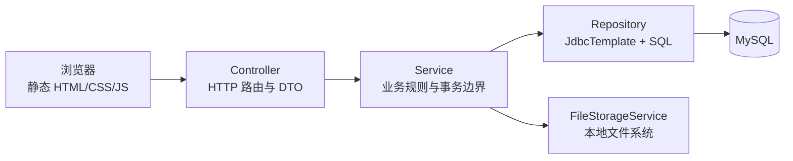
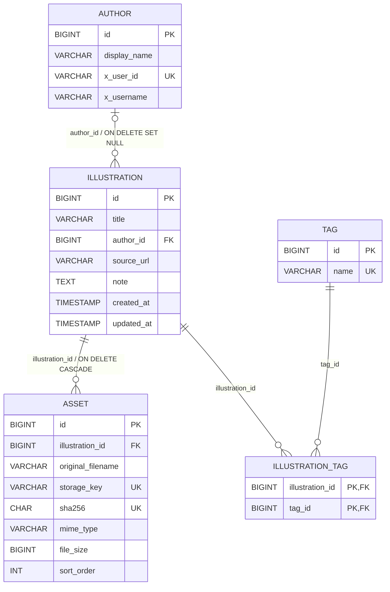

# Illustration Archive

一个面向个人使用的插画归档工具：用 Spring Boot 提供导入、图库、详情和元数据管理 API，用本地文件系统保存图片本体，用 MySQL 保存可查询的插画元数据。

## 项目简介

Illustration Archive 解决的是“把散落在本地的插画文件整理成可浏览、可追踪的个人图库”这一问题。

项目采用 local-first 设计：图片文件留在配置的本地存储目录，数据库只保存插画、作者、标签以及文件元数据。浏览器端使用 Spring Boot 静态资源目录中的原生 HTML、CSS 和 JavaScript，不需要前端构建工具。

V0.3 已正式封存，增加 X Likes 手动同步与多图归档；当前进入 V0.4 工程化阶段。`v0.1.0`、`v0.2.0` 和 `v0.3.0` 均已创建并 push tag。

## 项目截图

### 图库首页

支持批量导入插画，并以分页卡片形式展示图库内容。


### 插画详情页

支持查看插画大图、标题、作者、标签、备注和来源等元数据，并提供编辑与删除入口。


## 当前功能

- 导入 JPG、JPEG、PNG、GIF 图片；按文件内容计算 SHA-256 去重。单张重复导入返回 `409 Conflict` 和已有插画 ID；批量导入逐项返回 `SUCCESS`、`DUPLICATE` 或 `FAILED`，支持部分成功。
- 可按需对历史 Asset 执行 SHA-256 回填；新导入的 JPG/PNG 自动生成缩略图，也支持历史缩略图回填。
- 首页图库分页浏览，默认每页 24 条。JPG/PNG 卡片使用缩略图，GIF 保持原始动画；卡片显示封面、标题和作者，并可进入详情页。
- 多 Asset 卡片可左右循环预览；Artwork-first 详情页按顺序纵向展示全部原图，保持原始比例，并显示标题、作者、标签、备注和来源链接。
- 手动同步 X Likes：Inbox 页的 Sync latest Likes 每次从第一页查最近点赞；独立的后端 history continuation 接口保存分页游标，可跨轮、跨重启继续。页面加载不会自动请求 X API，也没有 history continuation 按钮。
- X Import Inbox 只展示 `PENDING` 候选，可单项或批量选择导入、跳过；逐项显示导入成功、重复或失败结果。无图、GIF、视频或混合媒体等不符合“全部直接附件为带 URL 的 photo”条件的 Post 标记为 `UNSUPPORTED`；跳过和成功导入分别变为 `SKIPPED`、`IMPORTED`。
- 将受支持的 X Post 单图或多图归档为一个 Illustration 和有序 Asset，以 SHA-256 拒绝整条 Post 中的重复图片；批量导入允许部分成功，并记录 `imported_illustration_id`。本地文件导入仍支持 GIF，X GIF/视频导入尚不支持。
- 编辑标题、来源链接、备注，并通过 PATCH 更新已有 Author 关联和 Tag 关联。
- 搜索和创建 Author；搜索、创建、选择、移除 Tag。
- 删除单个 Illustration，并在数据库删除事务提交后清理原图和缩略图。
- 通过 Asset 内容接口按 `asset id` 读取图片流；HTTP DTO 不暴露 `storage_key` 或本地绝对路径。
- 首页和详情页包含加载失败、空数据、图片加载失败以及批量导入结果等基础状态反馈。

## 技术栈

- Java 17
- Spring Boot 4.1.1
- Spring Web MVC
- Spring JDBC（`JdbcTemplate`）
- Flyway（数据库迁移）
- MySQL Connector/J
- Maven Wrapper
- 原生 HTML、CSS、JavaScript
- JUnit 5、Mockito、standalone MockMvc（测试）

项目没有使用 JPA；SQL 由 Repository 层通过 `JdbcTemplate` 执行。

## 系统架构


```mermaid
flowchart LR
    Browser["浏览器<br/>静态 HTML/CSS/JS"] --> Controller["Controller<br/>HTTP 路由与 DTO"]
    Controller --> Service["Service<br/>业务规则与事务边界"]
    Service --> Repository["Repository<br/>JdbcTemplate + SQL"]
    Repository --> MySQL[(MySQL)]
    Service --> Storage["FileStorageService<br/>本地文件系统"]
```

- `Controller` 只负责 HTTP 映射、参数接收和响应状态。
- `Service` 负责导入、编辑、删除、分页等业务流程，以及需要事务的数据库操作。
- `Repository` 集中保存 SQL 和结果映射。
- `FileStorageService` 负责文件校验、流式保存、读取、删除和存储路径安全检查。
- 静态前端通过 `/api/...` 调用后端，不直接接触数据库或文件系统路径。

## 数据模型与实体关系


```mermaid
erDiagram
    AUTHOR o|--o{ ILLUSTRATION : "author_id / ON DELETE SET NULL"
    ILLUSTRATION ||--o{ ASSET : "illustration_id / ON DELETE CASCADE"
    ILLUSTRATION ||--o{ ILLUSTRATION_TAG : "illustration_id"
    TAG ||--o{ ILLUSTRATION_TAG : "tag_id"

    AUTHOR {
        BIGINT id PK
        VARCHAR display_name
        VARCHAR x_user_id UK
        VARCHAR x_username
    }
    ILLUSTRATION {
        BIGINT id PK
        VARCHAR title
        BIGINT author_id FK
        VARCHAR source_url
        TEXT note
        TIMESTAMP created_at
        TIMESTAMP updated_at
    }
    ASSET {
        BIGINT id PK
        BIGINT illustration_id FK
        VARCHAR original_filename
        VARCHAR storage_key UK
        CHAR sha256 UK
        VARCHAR mime_type
        BIGINT file_size
        INT sort_order
    }
    TAG {
        BIGINT id PK
        VARCHAR name UK
    }
    ILLUSTRATION_TAG {
        BIGINT illustration_id PK,FK
        BIGINT tag_id PK,FK
    }
```

- 一个 `Illustration` 可以有多个 `Asset`；删除 Illustration 时由外键级联删除 Asset 和 `illustration_tag` 关联行。
- 一个 `Illustration` 可以不关联 Author，也可以关联一个 Author；一个 Author 可以关联零个或多个 Illustration。删除 Author 时，Illustration 的 `author_id` 由数据库置为 `NULL`。
- `Illustration` 与 `Tag` 是多对多关系，通过 `illustration_tag` 连接；删除 Tag 会级联删除关联行，当前没有删除 Tag 的 HTTP API。
- `asset.storage_key`、非空的 `asset.sha256`、Author 的非空 `x_user_id` 和 Tag 的 `name` 在数据库中有唯一约束；`x_username` 只有普通索引。
- X Likes 候选和附件分别保存在 `x_like_item`、`x_like_media`；`x_post_id` 唯一。历史续扫游标及已见游标摘要保存在 `x_like_sync_state`、`x_like_sync_seen_token`。

## 核心设计

### 本地文件与数据库元数据分离

图片本体保存在本地文件系统；`asset` 表保存 `original_filename`、`mime_type`、`file_size`、`sort_order` 和相对的 `storage_key`。数据库不保存图片二进制内容，也不把机器上的绝对路径暴露给 API。

存储根目录由 `illustration-archive.storage.root-dir` 配置，`storage_key` 只表示相对于该根目录的路径，例如 `2026-09/<generated-name>.png`。`FileStorageService` 会对路径进行规范化，拒绝绝对路径和越出配置根目录的路径，从而避免数据库绑定某一台机器的绝对路径。

### 文件校验与流式 IO

- 文件扩展名只接受 `.jpg`、`.jpeg`、`.png`、`.gif`。
- 文件内容还会读取并校验 JPEG、PNG、GIF 的文件魔数；扩展名与实际格式不匹配时拒绝导入。
- 单张图片的业务限制是 50 MB；`FileStorageService` 在保存过程中也会再次检查实际读取到的大小。
- 导入使用 `InputStream`，以缓冲区流式写入临时文件，再移动到按月份组织的目标路径，不把整张图片一次性读入内存。

### 导入的一致性策略

单张导入的顺序是“先保存文件，再执行数据库事务”：

1. `FileStorageService.store(...)` 完成校验，在流式保存时计算文件内容的 SHA-256。
2. 导入服务先查询相同 SHA-256，再由数据库唯一约束兜底并发重复；重复文件会被清理。
3. `IllustrationPersistenceService.persist(...)` 在 `@Transactional` 方法中插入 Illustration 和 Asset。持久化失败时尝试补偿删除刚保存的文件，并记录清理失败。
4. 持久化成功后尝试生成 JPG/PNG 缩略图；缩略图失败会记日志，不改变原图与数据库记录的成功导入结果。

批量导入逐项复用单张导入。某一项失败不会中断剩余项目；响应包含 `successCount`、`duplicateCount`、`failureCount`，每项有 `status` 和对应的处理结果。

### 删除的一致性策略

删除采用两个 Service 的边界：

1. `IllustrationDatabaseDeleteService.delete(...)` 使用 `@Transactional`，确认记录存在，按 `sort_order ASC, id ASC` 查询全部 Asset 的 `storage_key`，然后只执行 `DELETE FROM illustration WHERE id = ?`。Asset 和 `illustration_tag` 由外键级联处理，Author 和 Tag 本身不会被删除。
2. 数据库事务成功提交后，外层 `IllustrationDeleteService` 才逐个清理缩略图和原图。

文件系统操作无法参与 MySQL 事务，因此文件删除不会放在数据库事务方法内部。某个缩略图或原图删除失败时会记录包含 `storageKey` 和完整异常的 ERROR 日志，并继续清理其余文件；数据库删除不会被恢复。

### PATCH 的三态语义

`IllustrationPatchRequest` 会记录字段是否出现在 JSON 中：

- 字段未传：保持原值不变。
- `title`、`sourceUrl`、`note` 或 `authorId` 传普通值：更新关联字段。
- 上述可空字段显式传 `null`：清空字段或作者关联。
- `tagIds` 传 `[]`：清空全部标签；`tagIds` 缺失：标签保持不变；`tagIds: null`：非法。

Tag ID 会先校验存在性，并去除重复 ID，然后在同一数据库事务中替换关联行。

### 分页与稳定排序

图库查询使用数据库分页，不在内存中加载全部 Illustration。Repository 使用 `ORDER BY i.created_at DESC, i.id DESC`，在创建时间相同时用 ID 作为稳定的第二排序键。Asset 主图和详情中的 Asset 也按 `sort_order ASC, id ASC` 选择和展示。

## API 概览

### Illustration 与 Asset

| Method | Path | Request | Response / 行为 |
| --- | --- | --- | --- |
| `GET` | `/api/illustrations?page=0&size=24` | Query 参数可省略，默认 `page=0`、`size=24`；后端校验 `page >= 0`，`size` 必须为 `1..100` | `IllustrationGalleryPage`：`page`、`size`、`totalElements`、`totalPages`、`items[]`。每个 item 包含封面、`assetCount`、有序 `assets[]` 等公开摘要 |
| `GET` | `/api/illustrations/{id}` | Path variable `id` | `IllustrationDetail`：基础元数据、Author、`assets[]`、`tags[]`、创建/更新时间 |
| `PATCH` | `/api/illustrations/{id}` | `application/json`；可包含 `title`、`sourceUrl`、`note`、`authorId`、`tagIds` | 按上文三态语义更新，成功返回 `204 No Content` |
| `DELETE` | `/api/illustrations/{id}` | 无请求体 | 删除数据库记录并在事务提交后清理原图与缩略图，成功返回 `204 No Content` |
| `POST` | `/api/illustrations/import` | `multipart/form-data`；多个同名 `files` 字段，对应 `List<MultipartFile>` | `IllustrationBatchImportResult`，逐项报告成功、重复或失败 |
| `POST` | `/api/illustrations/import/single` | `multipart/form-data`；单个 `file` 字段 | 成功返回插画和 Asset ID；内容重复返回 `409 Conflict` 和已有插画 ID |
| `GET` | `/api/assets/{id}/content` | Path variable `id` | 以数据库中的 MIME type 和文件大小返回图片 `Resource` 内容流 |
| `GET` | `/api/assets/{id}/thumbnail` | Path variable `id` | 返回已有 JPG/PNG 缩略图；缺失时返回 `404` |

`IllustrationGalleryItem` 和 `IllustrationDetail` 都只返回 Asset 的公开摘要字段，不返回 `storage_key`。

批量导入响应的核心结构如下：

```json
{
  "total": 3,
  "successCount": 1,
  "duplicateCount": 1,
  "failureCount": 1,
  "items": [
    {
      "filename": "example.png",
      "success": true,
      "illustrationId": 10,
      "errorCode": null,
      "message": null,
      "status": "SUCCESS"
    },
    {
      "filename": "same-image.png",
      "success": false,
      "illustrationId": 10,
      "errorCode": "DUPLICATE_IMAGE",
      "message": "An illustration with the same image already exists.",
      "status": "DUPLICATE"
    },
    {
      "filename": "fake.jpg",
      "success": false,
      "illustrationId": null,
      "errorCode": "INVALID_FILE",
      "message": "Uploaded file is not a supported image format.",
      "status": "FAILED"
    }
  ]
}
```

当前实现使用的错误代码包括 `DUPLICATE_IMAGE`、`INVALID_FILE`、`STORAGE_FAILED` 和 `IMPORT_FAILED`。

### Author

| Method | Path | Request | Response |
| --- | --- | --- | --- |
| `POST` | `/api/authors` | `application/json`：`{ "displayName": "...", "xUsername": "..." }`；`xUsername` 可为空 | `201 Created`，返回 `AuthorDetail`（含 `id`、`displayName`、`xUsername`、`createdAt`、`updatedAt`） |
| `GET` | `/api/authors?keyword=...` | 可选查询参数 `keyword`；空关键词返回空列表 | `AuthorSummary[]`，按 `displayName ASC, id ASC`，最多 20 条 |

### Tag

| Method | Path | Request | Response |
| --- | --- | --- | --- |
| `POST` | `/api/tags` | `application/json`：`{ "name": "..." }` | `201 Created`，返回 `TagSummary` |
| `GET` | `/api/tags?keyword=...` | 可选查询参数 `keyword`；空关键词返回空列表 | `TagSummary[]`，按 `name ASC, id ASC`，最多 20 条 |

### X Import

| Method | Path | 行为 |
| --- | --- | --- |
| `POST` | `/api/x-import/sync/recent` | 手动从第一页同步最新 Likes；可选 `maxResults`（默认 5，范围 5..100）和 `maxPages`（默认 3，范围 1..10） |
| `POST` | `/api/x-import/sync/continuation` | 显式续扫历史 Likes；页数截断保存游标，自然末页清除游标 |
| `POST` | `/api/x-import/sync/continuation/reset` | 仅在历史游标为 `INVALID` 时显式重置 |
| `GET` | `/api/x-import/inbox` | 返回按 Post 时间倒序排列的 `PENDING` 候选及有序媒体 |
| `PATCH` | `/api/x-import/inbox/skip` | 跳过请求体 `itemIds` 中仍为 `PENDING` 的项 |
| `POST` | `/api/x-import/inbox/import` | 导入请求体 `itemIds` 中的项，逐项返回 `SUCCESS`、`DUPLICATE` 或 `FAILED` |

浏览器页面由静态资源提供：`/` 打开图库，`/detail.html?id={illustrationId}` 打开详情，`/x-import.html` 打开 Inbox。X API 默认关闭；Access Token 从本地忽略的配置文件或环境变量读取，变更后需重启应用。

## 项目结构

```text
.
├─ config/
│  └─ application-local.properties.example
├─ src/
│  ├─ main/
│  │  ├─ java/com/yuutara/illustrationarchive/
│  │  │  ├─ controller/       # HTTP 路由
│  │  │  ├─ dto/              # 请求/响应 DTO
│  │  │  ├─ repository/       # JdbcTemplate 与 SQL
│  │  │  ├─ service/          # 业务流程与事务
│  │  │  └─ storage/          # 本地文件存储、校验与安全路径
│  │  └─ resources/
│  │     ├─ db/migration/
│  │     │  ├─ V1__init_schema.sql
│  │     │  ├─ V2__add_asset_sha256.sql
│  │     │  ├─ V3__add_x_like_inbox.sql
│  │     │  ├─ V4__add_x_archive_links.sql
│  │     │  └─ V5__add_x_like_sync_continuation.sql
│  │     ├─ static/
│  │     │  ├─ index.html
│  │     │  ├─ app.js
│  │     │  ├─ detail.html
│  │     │  ├─ detail.js
│  │     │  ├─ x-import.html
│  │     │  ├─ x-import.js
│  │     │  └─ style.css
│  │     └─ application.properties
│  ├─ test/java/               # Controller、Service、Repository、Storage 测试
│  └─ test/js/                 # Inbox、Gallery、Detail 页面行为测试
├─ mvnw
├─ mvnw.cmd
├─ Dockerfile
├─ compose.yaml
├─ .dockerignore
├─ .env.example
└─ pom.xml
```

## 本地运行步骤

### 前置条件

- Java 17 或更高版本（项目编译目标为 Java 17）。
- 可连接的 MySQL 实例。
- Windows 可直接使用 `mvnw.cmd`；macOS/Linux 可使用 `mvnw`。

### 初始化数据库与本地配置

1. 创建数据库（表结构由 Flyway 在应用启动时执行）：

   ```sql
   CREATE DATABASE illustration_archive
       CHARACTER SET utf8mb4
       COLLATE utf8mb4_unicode_ci;
   ```

2. 复制配置示例，并只在本机填写实际值：

   ```powershell
   Copy-Item config/application-local.properties.example config/application-local.properties
   ```

   macOS/Linux：

   ```bash
   cp config/application-local.properties.example config/application-local.properties
   ```

3. 编辑 `config/application-local.properties` 中的必需项：

   - `ILLUSTRATION_ARCHIVE_DB_URL`
   - `ILLUSTRATION_ARCHIVE_DB_USERNAME`
   - `ILLUSTRATION_ARCHIVE_DB_PASSWORD`
   - `ILLUSTRATION_ARCHIVE_STORAGE_ROOT`

   存储根目录应是应用进程可读写的本地目录，建议放在 Git 仓库之外。该文件已被 `.gitignore` 忽略，不要提交真实密码或其他敏感配置。X API 不使用时保持 `X_API_ENABLED=false`、`X_API_ACCESS_TOKEN` 为空；需要手动同步时，在本地填入 Token 并显式开启，修改后重启应用。

### 启动应用

Windows PowerShell：

```powershell
.\mvnw.cmd spring-boot:run
```

macOS/Linux：

```bash
./mvnw spring-boot:run
```

Flyway 会在启动时执行 `src/main/resources/db/migration/` 中尚未应用的迁移。启动后访问：

<http://localhost:8080/>

在 IDEA 中直接运行 `IllustrationArchiveApplication` 时，将 Run Configuration 的 Working directory 设为项目根目录，并在启动前完成上述本地配置。`./config/application-local.properties` 相对于进程工作目录读取；若使用其他工作目录，可通过 Spring Boot 的 `spring.config.additional-location` 指向本地配置文件。确认启动日志显示应用已启动、Flyway 正常完成，并在浏览器打开首页；要验证真实导入与读取，还需使用本地 MySQL 和可写的存储根目录实际操作。

## Docker Compose 运行

安装 Docker 与 Docker Compose 后，在项目根目录复制密码示例并填写非空的本地开发密码：

```powershell
Copy-Item .env.example .env
# 编辑 .env 中的 ILLUSTRATION_ARCHIVE_DB_PASSWORD
docker compose up --build -d
docker compose logs -f app
```

macOS/Linux 可用 `cp .env.example .env`，其余 Compose 命令相同。首次启动会下载镜像、构建应用，并初始化 MySQL 数据库。Compose 等待 MySQL 的应用用户能执行查询后再启动 Spring Boot；Spring Boot 启动时按原有配置执行 Flyway migration。确认应用日志显示 Flyway 和 Spring Boot 启动成功，再访问 [Gallery](http://localhost:8080/)、[Inbox](http://localhost:8080/x-import.html)；从 Gallery 中的插画可进入 Detail。空数据库上的 Gallery 和 Inbox 起初为空。

```powershell
docker compose down
```

`down` 停止并移除容器，但保留 `mysql_data` 和 `archive_storage` 两个命名 volume；下次 `docker compose up -d` 会重新使用它们。前者挂载到 MySQL 的 `/var/lib/mysql`，后者挂载到应用的 `/data/storage`，保存原图和缩略图。**不要使用 `docker compose down -v` 停止日常开发环境**，该命令会删除这两个 volume 及其中的数据。MySQL 用户只在空数据目录首次启动时初始化；保留已有数据库 volume 时，不要仅修改 `.env` 密码而不同时修改数据库用户密码。Compose 数据与上文 IDEA 本地配置的数据库、存储目录相互独立；不会自动迁移已有归档。

Compose 用现有 A1 环境变量向应用注入 `jdbc:mysql://db:3306/illustration_archive`、应用数据库用户名、`.env` 中的密码以及 `/data/storage`；`db` 是 Compose 网络中的 MySQL service 名称，MySQL 端口只在该网络中使用。应用只在本机 `127.0.0.1:8080` 暴露。`.env` 已由 `.gitignore` 和 `.dockerignore` 排除；Dockerfile 只复制 `pom.xml` 和 `src/main`，不会把本地配置或密码放进镜像。不要将真实密码或 X Token 写入 Compose 文件或提交到 Git。容器中明确设置 `X_API_ENABLED=false`，不注入 X Token。IDEA 非 Docker 启动仍使用上文的本地配置方式。

## 配置说明

`src/main/resources/application.properties` 会导入可选的 `./config/application-local.properties`。下表中的大写名称可放在该文件中，也可作为进程环境变量提供；环境变量优先。无需把本地配置文件复制到 `src/main/resources`。Spring Boot 自带的外部配置机制也允许在启动参数中覆盖属性。

| 配置项 | 启动要求与用途 |
| --- | --- |
| `ILLUSTRATION_ARCHIVE_DB_URL` | 必需：MySQL JDBC URL；示例指向本机 `illustration_archive` 数据库 |
| `ILLUSTRATION_ARCHIVE_DB_USERNAME` | 必需：MySQL 用户名 |
| `ILLUSTRATION_ARCHIVE_DB_PASSWORD` | 必需：MySQL 密码；本地开发也需显式提供，允许数据库用户使用空密码时值为空 |
| `ILLUSTRATION_ARCHIVE_STORAGE_ROOT` | 必需：图片本地存储根目录；数据库只保存相对 `storage_key` |
| `X_API_ENABLED`、`X_API_ACCESS_TOKEN` | 可选：默认关闭；只有显式开启并提供 Token 才能手动同步 X Likes |
| `X_API_BASE_URL` | 可选：默认 `https://api.x.com` |
| `X_API_DEFAULT_PAGE_SIZE`、`X_API_DEFAULT_MAX_PAGES` | 可选：X Likes 默认页大小 5、最多页数 3 |

`spring.application.name`、MySQL 驱动类、`spring.servlet.multipart.max-file-size=60MB` 和 `spring.servlet.multipart.max-request-size=500MB` 保留固定默认值；它们不包含机器路径或 secret。历史回填的 `illustration.maintenance.sha256-backfill` 与 `illustration.maintenance.thumbnail-backfill` 均默认关闭，只在显式设置为 `true` 的启动中运行；不要作为日常启动配置保留。

HTTP multipart 配置上限不等同于图片业务校验上限：`FileStorageService` 的单张图片业务限制仍是 50 MB。

### 历史 SHA-256 回填

历史 Asset 的 SHA-256 回填默认关闭。需要执行时，临时设置 `illustration.maintenance.sha256-backfill=true` 并重启应用；完成后删除该配置或设为 `false`。回填只处理 SHA-256 为空的记录，报告更新、重复和失败项；可安全重跑。

### 历史缩略图回填

新导入的 JPEG/PNG 会在原图和数据库记录成功保存后尝试生成缩略图；生成失败只记日志，不影响导入成功响应，也不会删除原图或数据库记录。GIF 正常导入但不生成缩略图。历史回填默认关闭。需要执行时，在 `config/application-local.properties` 临时添加：

```properties
illustration.maintenance.thumbnail-backfill=true
```

重启应用后会按 Asset id 顺序处理数据库中的 JPEG/PNG/GIF Asset：JPEG/PNG 记为 `READY`，GIF 明确记为 `SKIPPED_GIF`，单项生成异常记为 `FAILED` 并继续。完成后将属性删除或设为 `false`，即可关闭启动时回填；要重跑时再次设为 `true` 并重启。已有缩略图会被复用，因此重跑安全。缩略图失败不会删除原图或数据库记录；日志末尾汇总 `total`、`ready`、`skippedGif` 和 `failed` 数量。

## 测试与构建

使用 Maven Wrapper 执行测试和打包：

```powershell
.\mvnw.cmd test
.\mvnw.cmd package
```

macOS/Linux：

```bash
./mvnw test
./mvnw package
```

测试覆盖 Controller 的 standalone MockMvc、Service 业务流程、Repository SQL/映射以及 FileStorageService 的校验和路径行为；当前测试使用 Mockito、模拟的 `JdbcTemplate` 和临时目录，不需要连接真实 MySQL。

## 版本状态

`v0.1.0`、`v0.2.0` 和 `v0.3.0` tag 均已创建并 push。V0.3 已正式封存，具备 X Likes 手动同步、Inbox 照片归档和多 Asset 浏览能力。当前为 V0.4 工程化阶段，A1 运行时配置外置化与 A2 Docker & Docker Compose 均已完成；A2 的镜像构建、MySQL/Flyway、应用启动、图片导入及容器重建后持久化已通过真实人工验收，具体边界见 `docs/PROJECT_STATE.md`。

当前版本仍然是单机、本地文件系统存储；没有 OAuth、Token 自动刷新、后台自动同步、用户认证或云对象存储。

## Roadmap

- X GIF/视频等非静态图片媒体导入，以及导入来源信息的进一步整理。
- Inbox 紧凑网格、缩放与列数调整、选择体验、hover 动画、筛选，以及 history continuation 页面入口。
- OAuth 与 Token 自动刷新。
- 感知哈希重复检测与合并策略。
- 孤儿文件扫描、诊断和人工确认后的修复工具。
- 更丰富的图库搜索、筛选、排序和批量整理能力。
- 在保持 `storage_key` 与数据库元数据解耦的前提下，继续整理可替换的存储实现。

Roadmap 中的内容不属于 V0.3 已完成范围。
